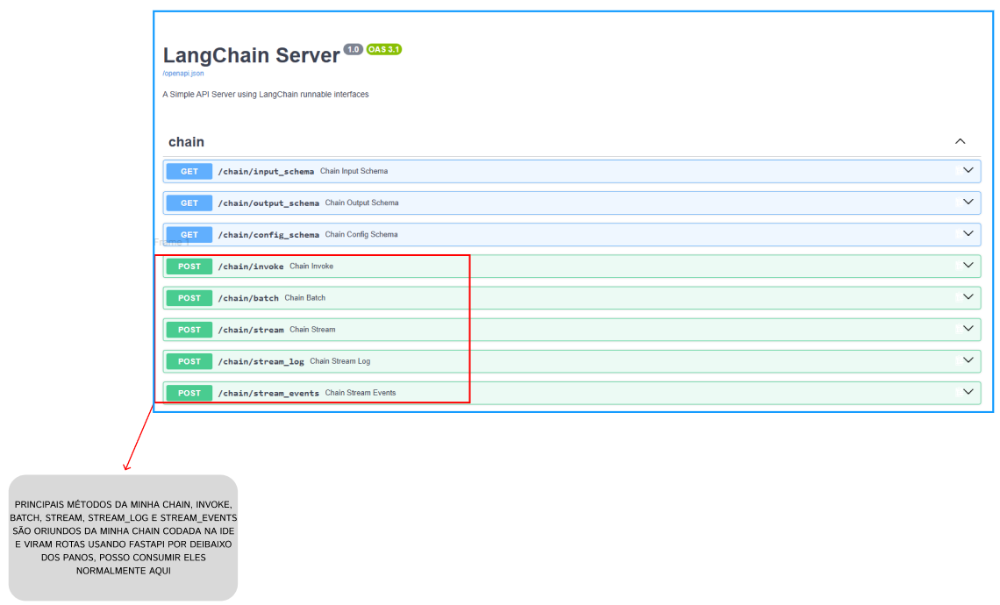
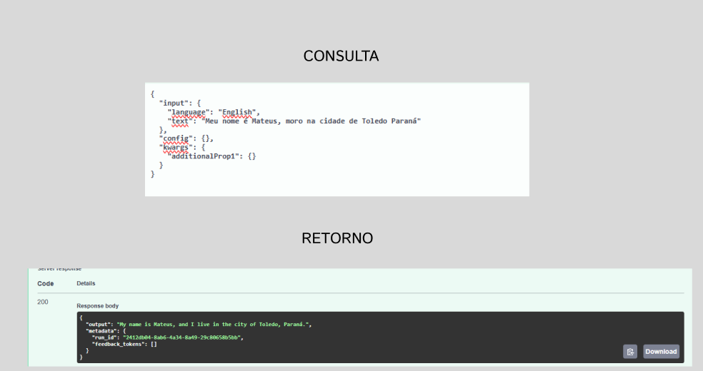

# 🦜 Server de Tradução com LangChain & LangServe

Este repositório contém uma aplicação Python que disponibiliza uma chain de tradução criada via **LCEL (LangChain Expression Language)** como uma API REST pronta para produção utilizando **FastAPI** e **LangServe**.

---

## 🎯 Objetivo do Projeto

Transformar um fluxo de IA (prompt + LLM + parser) em uma interface de endpoints HTTP documentados via **OpenAPI/Swagger**, permitindo a fácil integração de aplicações clientes (web, mobile ou outros microsserviços) e fornecendo uma interface visual de testes (Playground).

---

## 🏗️ Arquitetura da Chain

A chain de execução é composta por três etapas encadeadas via pipeline (`|`):

1. **Prompt Template (`ChatPromptTemplate`)**: Recebe as variáveis `{language}` (idioma desejado) e `{text}` (texto a ser traduzido).
2. **Modelo LLM (`init_chat_model`)**: Utiliza o provedor **Groq** com o modelo `openai/gpt-oss-20b`.
3. **Output Parser (`StrOutputParser`)**: Converte a resposta bruta do modelo em uma string de texto limpa.

---

...

